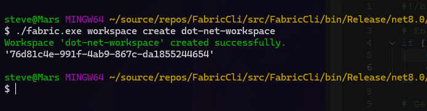
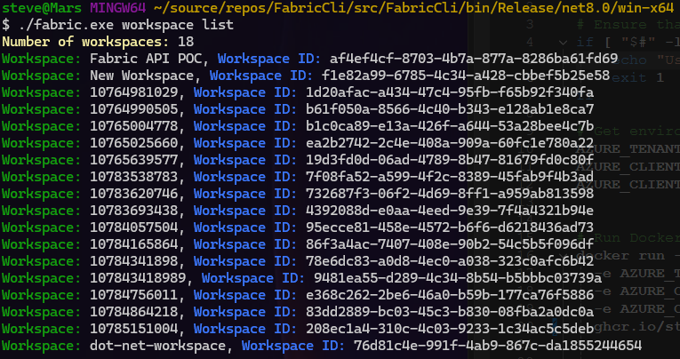
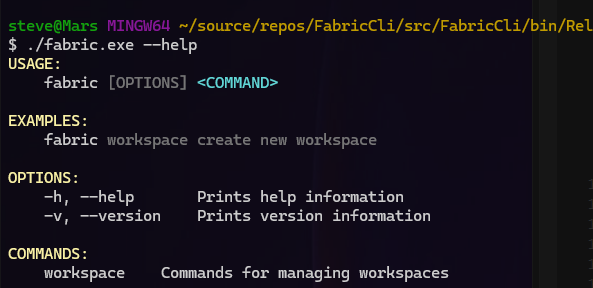
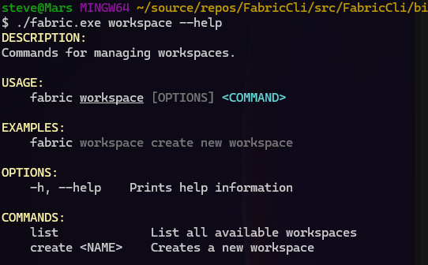

# Fabric CLI

Fabric CLI is a command-line interface tool built with C# and .NET 8.0, designed to interact with the Microsoft Fabric API. It provides a set of commands to manage workspaces, including creating new workspaces and listing all available workspaces.

## Prerequisites

In order for FabricCli to work, the following is required:

- Service Principle with the permissions required to use Fabric API
- Then you must set the following environment variables:

    - `AZURE_TENANT_ID`: This is the directory (tenant) ID of the Azure Active Directory (AAD) you're using. It's a globally unique identifier (GUID) that is different than your organization name or domain.
    - `AZURE_CLIENT_ID`: This is the Application (client) ID of the app registration in your AAD. It's also a GUID and is used by the application to identify itself to the users that it's requesting permissions from.
    - `AZURE_CLIENT_SECRET`: This is a secret string that the application uses to prove its identity when requesting a token. It can also be referred to as an application password.

## Microsoft.Fabric.Api SDK

The project uses the Microsoft.Fabric.Api SDK to interact with the Fabric API. This SDK provides a set of classes and methods that make it easier to communicate with the API. It handles the details of making requests to the API, including serializing the request data into the appropriate format and deserializing the response data. This allows you to focus on the logic of your application, rather than the details of communicating with the API.

## Building the Project

The project is built using the .NET SDK. The build process is defined in the `Dockerfile` located in the `src/FabricCli` directory. The Dockerfile uses the .NET SDK to restore dependencies, build, and publish the project. The final stage of the Dockerfile creates a runtime-deps image and copies the published output into it.

The project is also configured to be built and pushed to a Docker registry using GitHub Actions. The workflow is defined in `.github/workflows/docker-image.yml`. This workflow is triggered on push to the 'release' branch. It checks out the repository, logs in to the GitHub Container Registry, extracts metadata for Docker, builds and pushes the Docker image, and generates an artifact attestation.

## Authentication

Authentication in this project is handled using Azure Identity. The `FabricClientFactory` class creates a `FabricClient` instance using an `EnvironmentCredential` for authentication. The `EnvironmentCredential` attempts to authenticate using environment variables `AZURE_TENANT_ID`, `AZURE_CLIENT_ID`, and `AZURE_CLIENT_SECRET`.

The `fabric.sh` script is used to run the Docker container with these environment variables. The values for these variables are expected to be set in the system where this script is run.

## Commands

The project provides commands for managing workspaces. These commands are defined in the `FabricCli.Command.Workspace` namespace.

### Create Workspace

The `create` command is used to create a new workspace. The name of the workspace to be created is passed as an argument to this command.

### List Workspaces

The `list` command is used to list all available workspaces.

## Help

For more information on how to use the commands, you can use the `help` command.

For help related to workspace commands, you can use the `workspace help` command.

## Contributing

Contributions are welcome. Please feel free to open an issue or submit a pull request.

## License

This project is licensed under the terms of the MIT license.